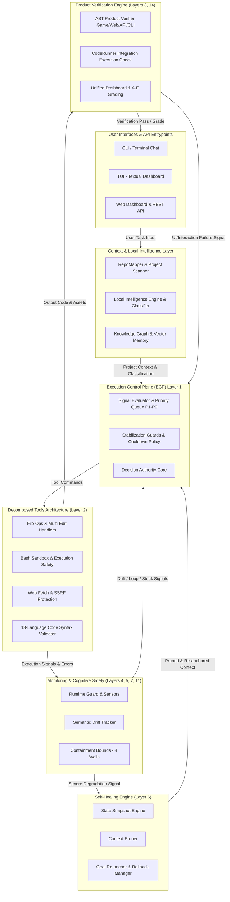
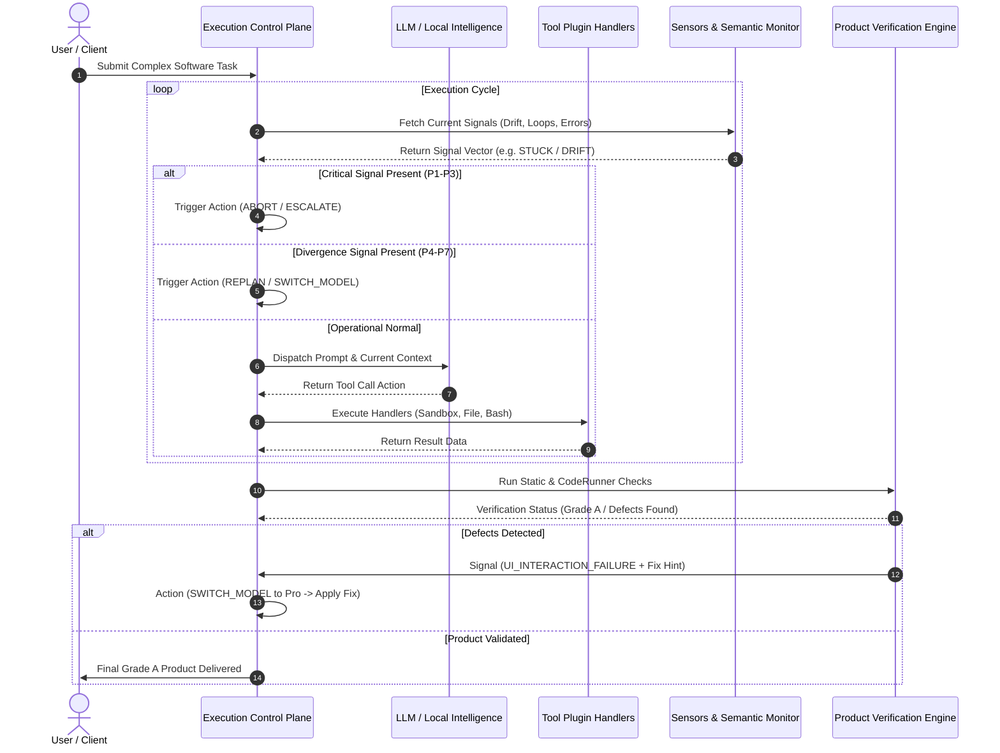
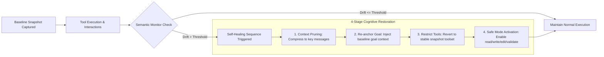

# WIDDX Nexus

[](LICENSE)
[](pyproject.toml)
[](https://github.com/widdx1990/widdx-cli-light)
[](docs/FINAL-REPORT.md)
[](docs/reports/PROJECT-COMPARISON.md)

> **Cognitive Runtime Operating System** — Self-governing AI platform with closed-loop adaptive control, semantic stability, self-healing, and domain product verification.

Created with 🇵🇸 by **[MUHAMMAD MUSLIH](https://widdx.com)** — Founder & CEO of WIDDX

---

## Table of Contents

- [What is WIDDX Nexus?](#what-is-widdx-nexus)
- [WIDDX Nexus vs Devin & Competitors](#widdx-nexus-vs-devin--competitors)
- [Architecture — 14 Production Layers](#architecture--14-production-layers)
- [System Architecture Flowchart (Mermaid)](#system-architecture-flowchart-mermaid)
- [Execution Control Plane (ECP) & Sequence Diagram](#execution-control-plane-ecp--sequence-diagram)
- [Self-Healing & Semantic Stability Engine](#self-healing--semantic-stability-engine)
- [Product Verification Engine](#product-verification-engine)
- [Decomposed Tool Plugin Architecture](#decomposed-tool-plugin-architecture)
- [Quick Start & Installation](#quick-start--installation)
- [Provider Setup](#provider-setup)
- [Development & Testing](#development--testing)
- [License](#license)

---

## What is WIDDX Nexus?

WIDDX Nexus is **not a passive chatbot or a basic script wrapper**. It is a **14-layer Cognitive Runtime Operating System** engineered for autonomous software engineering and complex reasoning. 

Unlike conventional LLM agent loops that drift, hallucinate, or get stuck in infinite retry loops, WIDDX Nexus enforces **mathematical bounds, semantic trajectory tracking, closed-loop self-healing, and automated product verification**.

### Core Pillars

- **Execution Control Plane (ECP)**: Single decision authority with 5 control actions and 9 signal priority queues.
- **Closed-Loop Semantic Stability**: Monitors goal drift, trajectory divergence, and context contamination in real-time.
- **Self-Healing Engine**: Automatic context pruning, snapshotting, step-rollback, and re-anchoring when context degrades.
- **Product Verification Engine**: Domain-specific static & runtime checkers (Game, Web, API, CLI) verifying product output quality before completion.
- **Local Intelligence Engine**: Zero-LLM fallback classifier, rule evaluator, and pattern matcher ensuring high performance without unnecessary API calls.
- **Containment Bounds**: 4 strict mathematical boundaries (Drift, Invariance, Lyapunov convergence, SPC).
- **Scientific Auditability**: Full deterministic replay engine with step-by-step execution recording and signal delta analysis.

---

## WIDDX Nexus vs Devin & Competitors

The following comparative table contrasts **WIDDX Nexus** against **Cognition's Devin AI Software Engineer**, as well as traditional AI coding tools (such as Cursor and Claude Code):

| Feature / Dimension | **WIDDX Nexus** | **Devin (Cognition AI)** | **Cursor / Claude Code** |
| :--- | :--- | :--- | :--- |
| **System Architecture** | **14-Layer Cognitive Runtime OS** with deterministic safety bounds | Monolithic agent loop running in a web sandbox | IDE plugin / Terminal assistant wrapper |
| **Decision Authority** | **ECP (Execution Control Plane)** — Single control authority with 9 priority queues & 5 actions | Freeform LLM tool selection chain | User-guided or direct prompt execution |
| **Semantic Drift & Trajectory Monitoring** | **Real-time measurement** of goal drift, trajectory divergence, and contamination | None (suffers from accumulated context degradation) | None |
| **Self-Healing Mechanics** | **Automatic 4-stage restoration**: Snapshot → Prune → Rollback → Re-anchor | Manual restart or basic prompt retry on failure | Manual developer intervention required |
| **Containment & Safety Guarantees** | **4 Mathematical Bounds** (Drift, Invariance, Lyapunov stability, SPC) | Timeout caps & OS sandbox isolation | Manual confirmation / permission flags |
| **Product Verification Engine** | **AST & Runtime product verifiers** (Game, Web, API, CLI, CodeRunner) | Code execution output & browser snapshot | Unit tests or manual inspection |
| **Local Intelligence & Offline Support** | **Built-in Local Intelligence Engine** (no LLM required for routing & classification) | 100% Cloud LLM dependent | 100% Cloud API dependent |
| **Provider Agnosticism** | Supports **OpenCode Zen (Free)**, DeepSeek, Ollama, GGUF local models, OpenAI API | Closed, proprietary model stack | Subscription-locked API models |
| **Execution Auditability** | **Deterministic Replay Engine** with step-by-step state & signal diffing | Screen replay & terminal logs | Ephemeral chat logs |
| **Cost & Token Efficiency** | **Dynamic model switching** (Flash ↔ Pro routing) & token budget scaling | High per-task billing / token usage | Token-based usage limits |
| **Autonomy Level Score** | **Level 5.0** (Self-governing, self-correcting, verified output) | Level 4.0 | Level 3.0 - 3.5 |

---

## Architecture — 14 Production Layers

WIDDX Nexus organizes software autonomy into **14 modular production layers**, ensuring complete observability, controllability, and stability:

```
+-----------------------------------------------------------------------------------+
|                           14. Unified Dashboard (Grade A->F)                     |
+-----------------------------------------------------------------------------------+
                                          |
     +------------+------------+----------+----------+------------+------------+
     |   1. ECP   |5. Semantic |6. Healer |8. Adaptive|9. Exp.    |11. Containment
     |  (Brain)   |  (Drift)   | (Restore)| (Policy) |  (A/B)     | (4 Walls)  |
     +-----+------+-----+------+----+-----+----+-----+-----+------+-----+------+
           |            |           |          |           |            |
     +-----+------------+-----------+----------+-----------+------------+------+
     | 4. Sensors | 7. Invari.| 10. Meta |12. MCL   | 13. CTI    |3. Benchmarks|
     | (Signals)  | (Contracts| (Lyapunov| (Reflex) | (Pressure) | (Grading)   |
     +-----+------+-----------+----------+----------+------------+-------------+
           |
     +-----+-------------------------------------------------------------------+
     | 2. Decomposed Tool Plugin Architecture (8 Handlers, 21 Tools)          |
     +-------------------------------------------------------------------------+
```

| # | Layer | Purpose & Description | Implementation Status |
|:-:| :--- | :--- | :-:|
| **1** | **Execution Control Plane (ECP)** | Single decision authority applying control actions (`REPLAN`, `SWITCH_MODEL`, `ESCALATE`, `ABORT`, `CONTINUE`) based on priority queues. | **10 / 10** |
| **2** | **Tools Plugin Engine** | Decomposed plugin architecture across 8 secure handler modules providing 21 specialized file, execution, web, and validation tools. | **10 / 10** |
| **3** | **Benchmarks & Grading** | Real-time execution tracing and automated product quality evaluation returning letter grades (Grade A to F). | **9 / 10** |
| **4** | **Signal Sensors** | Active signal collection pipeline monitoring runtime guards, emotional/stress parameters, and escalation signals. | **9 / 10** |
| **5** | **Semantic Stability** | Mathematical vector tracking evaluating goal drift, trajectory divergence, and context window contamination. | **10 / 10** |
| **6** | **Self-Healing Engine** | Cognitive restoration system performing snapshot capture, context pruning, state rollback, and goal re-anchoring. | **9 / 10** |
| **7** | **Invariance System** | Enforces 7 strict system invariants and 5 state recovery contracts during execution loops. | **9 / 10** |
| **8** | **Adaptive Policy Engine** | Evidence-weighted policy parameter optimizer with full audit trails (`.widdx/policy_proposals.json`). | **9 / 10** |
| **9** | **Counterfactual Experiments** | A/B hypothesis engine running counterfactual executions with statistical confidence intervals. | **9 / 10** |
| **10** | **Meta-Learning** | Lyapunov function convergence monitor evaluating ongoing system learning KPIs. | **8 / 10** |
| **11** | **Containment System** | Enforces 4 strict mathematical bounds: Drift limit, Invariance bound, Lyapunov stability, and Statistical Process Control (SPC). | **10 / 10** |
| **12** | **Constraint Reflexivity (MCL)** | Dynamic constraint reflection tracking system rigidity, suppression rates, and cross-module coupling. | **8 / 10** |
| **13** | **Constraint Transparency Index (CTI)** | Metrics calculator for constraint visibility, system friction, and optimal execution pressure models. | **9 / 10** |
| **14** | **Unified Dashboard** | Single JSON state engine computing operational health, component contribution scores, and overall grades. | **10 / 10** |

---

## System Architecture Flowchart (Mermaid)

The overall flow of data, control signals, and feedback loops across the WIDDX Nexus Operating System is illustrated below:



---

## Execution Control Plane (ECP) & Sequence Diagram

The **Execution Control Plane (ECP)** sits directly inside the core agent loop. Before every LLM call and immediately following tool execution, the ECP evaluates incoming signals against priority rules to make deterministic operational decisions.

### 5 Control Actions

1. **`CONTINUE`**: Execution proceeds normally with the default strategy.
2. **`REPLAN`**: Re-analyzes current state and generates a fresh execution plan mid-task (Triggered by `STUCK` or `LOOP_DETECTED`).
3. **`SWITCH_MODEL`**: Instantly changes model tier (e.g., Flash $\leftrightarrow$ Pro, or OpenCode Zen $\rightarrow$ DeepSeek) when facing high error rates or quality degradation.
4. **`ESCALATE`**: Hands off control to the 8-role `ExpertTeam` pipeline when complexity or deadlock exceeds single-agent bounds.
5. **`ABORT`**: Gracefully and safely halts execution when safety boundaries or token limits are violated.

### Priority Queue (P1 -> P9)

```
P1: Critical Safety Breaches / Abort Flags   --> ABORT
P2: Memory & Token Pressure Bounds           --> ABORT
P3: Unrecoverable Execution Deadlock          --> ESCALATE
P4: Infinite Execution Loop Detected         --> REPLAN
P5: Agent Execution Stuck                    --> REPLAN / ESCALATE
P6: Tool Failure Rate >= 50%                 --> SWITCH_MODEL (Flash -> Pro)
P7: Output Quality Degradation               --> SWITCH_MODEL
P8: Complexity Drift >= 70%                  --> ESCALATE
P9: Token Efficiency Threshold               --> SWITCH_MODEL (Pro -> Flash)
```

### ECP Interactive Sequence Flow (Mermaid)



---

## Self-Healing & Semantic Stability Engine

When context bloats, goal drift occurs, or tool pollution sets in, WIDDX Nexus activates its **Cognitive State Restoration Engine**:



---

## Product Verification Engine

WIDDX Nexus guarantees product readiness by evaluating final software deliverables through specialized verifiers before declaring completion:

```
                  +-----------------------------------+
                  |   Agent Generates Game / Web App  |
                  +-----------------+-----------------+
                                    |
                                    v
                  +-----------------------------------+
                  |  Domain Verifier AST Analysis     |
                  +-----------------+-----------------+
                                    |
                     +--------------+--------------+
                     |                             |
                     v                             v
           [ Defect Detected ]           [ Zero Defects Found ]
           Double-jump bug, boundary             |
           or HTML syntax error                  v
                     |                    +------------------+
                     v                    | Deliver Product  |
           [ Signal Sent to ECP ]         |     Grade A      |
           UI_INTERACTION_FAILURE         +------------------+
                     |
                     v
           [ ECP Action Applied ]
           SWITCH_MODEL (Pro) + Fix Hint
```

### Verifier Matrix

- **GameVerifier**: Validates boundary mechanics, sprite collisions, key repeat handling, double-jump mechanics, and canvas scaling.
- **WebVerifier**: Checks HTML5 DOCTYPE validity, asset links, DOM structure, CSS binding, and multi-file imports.
- **APIVerifier**: Runs route inspection, HTTP status schemas, CORS headers, and input parameter handling.
- **CLIVerifier**: Assesses exit code compliance, STDOUT/STDERR formatting, and parameter parsing.

---

## Decomposed Tool Plugin Architecture

Refactored into **8 high-cohesion handler modules** supporting 21 execution tools:

```
core/tools/
├── __init__.py           # Public API entrypoint
├── registry.py            # Tool definition registry
├── dispatch.py            # Unified tool execution dispatcher
├── safety.py              # Sandbox path & permission validation
├── registration.py        # Native tool registration definitions
└── handlers/
    ├── file_ops.py        # File reading, writing, searching, globbing
    ├── edit_files.py      # Multi-file atomic pattern editing
    ├── bash.py            # Secure subprocess execution
    ├── web.py             # SSRF-protected web fetching & browser
    ├── validate.py        # 13-language AST syntax validator
    ├── spawn.py           # Sub-agent orchestration spawning
    └── linter.py          # Multi-language linter integration
```

---

## Quick Start & Installation

### Option 1: Install via pip

```bash
pip install git+https://github.com/widdx1990/widdx-cli-light.git
```

### Option 2: Install from source

```bash
git clone https://github.com/widdx1990/widdx-cli-light.git
cd widdx-cli-light
pip install -e .
```

### Launch Modes

```bash
# Terminal Chat CLI
widdx

# Terminal User Interface (TUI powered by Textual)
widdx-tui

# Web Dashboard (FastAPI) -> http://localhost:8000
widdx-web

# REST API Server
widdx-api
```

---

## Provider Setup

WIDDX Nexus includes automated failover and zero-configuration support:

| Provider | Type | API Key Required? | Description |
| :--- | :--- | :---: | :--- |
| **OpenCode Zen** | Cloud | **No (Free)** | **Default provider.** Instant zero-setup access. |
| **DeepSeek** | Cloud | Yes | Ideal for heavy coding and reasoning tasks. |
| **Ollama** | Local | No | Fully offline execution with local LLMs. |
| **GGUF Direct** | Local | No | Runs quantized GGUF models directly on CPU/GPU. |
| **OpenAI Compatible** | Cloud | Yes | Supports any OpenAI-compatible API endpoint. |

---

## Development & Testing

WIDDX Nexus maintains full test suite coverage:

```bash
# Install development dependencies
make install-dev

# Run total test suite (508 test suites)
pytest

# Run tests via Makefile
make test

# Run code linters
make lint
```

---

## License

This project is licensed under the **MIT License** — see the [LICENSE](LICENSE) file for details.

Created with 🇵🇸 by **[MUHAMMAD MUSLIH](https://widdx.com)** — Founder & CEO of WIDDX
