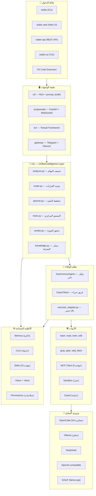

# ◈ WIDDX Nexus v3.0.0

**نظام تشغيل للذكاء الاصطناعي — يحول أي نموذج إلى آلة عمل ذكية متكاملة**

<div align="center">

[](.)
[](https://www.python.org/)
[](LICENSE)
[](.)
[](.)

**By [MUHAMMAD MUSLIH](https://widdx.com) — 🇵🇸 Made in Palestine**

[English Version](README_EN.md) | [معايير الكود](CODING_STANDARDS.md) | [خارطة الطريق](ROADMAP.md)

</div>

---

## 💡 الجوهر — لماذا WIDDX Nexus؟

### المشكلة

النماذج اللغوية وحدها — حتى أقواها — محدودة:

- **تنسى** كل شيء بعد الجلسة
- **لا تستطيع** تنفيذ أوامر حقيقية على جهازك
- **لا تعرف** شيئاً عن مشروعك أو ملفاتك
- **لا تستطيع** العمل في الخلفية أو الجدولة
- **لا تتواصل** مع العالم الخارجي (متصفح، APIs، منصات مراسلة)

الحل التقليدي: ادفع $200/شهرياً لنموذج متطور… وحتى هذا لا يحل المشاكل أعلاه.

### الحل — فلسفة WIDDX Nexus

> **نموذج ضعيف + أدوات قوية + نظام ذكي = نموذج قوي.**

WIDDX Nexus ليس مجرد "واجهة شات". إنه **نظام تشغيل للذكاء الاصطناعي** (AI Operating System) — طبقة ذكاء كاملة تُغلّف أي نموذج لغوي وتزوده بـ:

- **أدوات حقيقية** — باش، قراءة/كتابة ملفات، بحث، تحكم بالمتصفح
- **ذاكرة دائمة** — طبقتان (عالمية + مشروع)，تتعلم من كل محادثة
- **تخطيط ذكي** — UIL Pipeline يحلل مدخلك ويقرر أفضل طريقة للتنفيذ
- **تنفيذ آمن** — Sandbox عزل + Guard أنماط خطيرة + 4 مستويات صلاحيات
- **عمل 24/7** — Cron Scheduler + Background Tasks + متعدد المنصات

### المقارنة — قبل وبعد

| | بدون WIDDX | مع WIDDX Nexus |
|---|-----------|----------------|
| **النموذج** | GPT-4 → $10/يوم | OpenCode Zen (مجاني) → أداء GPT-4 |
| **الذاكرة** | ينسى كل جلسة | Memory يتعلم ويتراكم |
| **التنفيذ** | المستخدم ينتظر الرد | Background + Cron → يعمل 24/7 |
| **التعدد** | محادثة واحدة | Delegation → 3 عملاء بالتوازي |
| **الأمان** | لا حماية | Guard + Sandbox + Permissions |
| **الوصول** | تطبيق واحد | CLI + Web + TUI + Telegram + Discord + VS Code |

---

## 🧬 ما هو WIDDX Nexus بالضبط؟

WIDDX Nexus هو **منصة AI متكاملة** تعمل داخل الطرفية (Terminal)، صُممت من الألف إلى الياء لتكون:

### 1. عقل مركزي للذكاء الاصطناعي (Central AI Brain)

طبقة **UIL (Unified Intelligence Layer)** هي قلب النظام — Pipeline من 7 مراحل تعالج كل مدخل:

```
مدخل المستخدم
    │
    ▼
[1] المحلل (Analyzer)      → تصنيف المهمة: كتابة كود؟ بحث؟ تعديل؟ نظام؟
    │
    ▼
[2] الموجه (Router)         → تحديد وضع التنفيذ: محادثة بسيطة؟ عميل ذاتي؟ فريق خبراء؟
    │
    ▼
[3] المخطط (Planner)       → تفكيك المهمة المعقدة لخطوات (بدون LLM)
    │
    ▼
[4] المنفذ (Executor)       → تنفيذ عبر AutonomousAgent أو ExpertTeam أو أداة مباشرة
    │
    ▼
[5] المدقق (Verifier)       → فحص الجودة: هل الكود يشتغل؟ هل الـ HTML سليم؟
    │
    ▼
[6] المعرفة (Knowledge)     → تسجيل النتيجة في قاعدة المعرفة للتعلم منها
    │
    ▼
[7] التغذية الراجعة (Feedback) → إذا فشل التحقق → إعادة المحاولة تلقائياً مع التصحيح
    │
    ▼
النتيجة النهائية → المستخدم
```

### 2. متعدد النماذج (Multi-Provider)

لا توجد قيود على المزوّد. اختر ما يناسبك:

| المزوّد | التكلفة | الميزة |
|---------|---------|--------|
| **OpenCode Zen** | 🆓 مجاني | deepseek-v4-flash-free — أداء ممتاز بدون تكلفة |
| **Ollama** | 🆓 مجاني (محلي) | نماذج محلية بالكامل — لا إنترنت، خصوصية كاملة |
| **DeepSeek** | 💰 ~$0.5/يوم | تفكير عميق + تكلفة منخفضة |
| **OpenAI** | 💰💰 ~$10/يوم | GPT-4o للحالات الحرجة |
| **GGUF** | 🆓 مجاني (محلي) | تحميل مباشر لملفات `.gguf` — بدون Ollama |

**اكتشاف القدرات تلقائياً:** النظام يفحص كل مزوّد ليعرف إذا كان يدعم Tool Calling، Streaming، Reasoning — ويكيّف أسلوب التعامل.

**تدرج احتياطي (Fallback):** إذا فشل مزوّد، ينتقل للتالي تلقائياً.

### 3. متعدد الوكلاء (Multi-Agent)

- **AutonomousAgent** — وكيل ذكي ذاتي القيادة: يحلل، يقرر، ينفذ، يتحقق من النتيجة. يعيد المحاولة إذا فشل.
- **ExpertTeam** — 4 وكلاء متخصصين: منسق → باحث → مبرمج → مراجع. كل منهم يمرر مخرجاته للتالي.
- **Delegation** — توزيع المهام الفرعية على وكلاء متوازيين يعملون في آن واحد.
- **Background Tasks** — مهام تعمل في الخلفية والمستخدم يواصل عمله.

### 4. متعدد القنوات (Multi-Channel)

نفس العقل، أي واجهة:

| القناة | الاستخدام |
|--------|----------|
| **CLI** (`widdx`) | الطرفية — الأساسية والأسرع |
| **Web UI** (`widdx-web`) | متصفح — Dashboard + شات + أدوات |
| **REST API** (`widdx-api`) | برمجي — للتكامل مع أنظمتك |
| **TUI** (`widdx-tui`) | طرفية متقدمة — Textual framework |
| **VS Code Extension** | داخل المحرر — Explain, Fix, Generate |
| **Telegram + Discord** | جوال — اسأل WIDDX من أي مكان |

---

## 🏗️ المعمارية — نظرة شاملة



### هيكل المجلدات

| المجلد | المحتوى | اللغة |
|--------|---------|-------|
| `core/` | **المحرك** — 80+ ملف: UIL، وكلاء، أدوات، مزودين، MCP، Cron | Python |
| `core/uil/` | **طبقة الذكاء** — pipeline من 7 مراحل لمعالجة كل مدخل | Python |
| `cli/` | **واجهة الطرفية** — Rich + prompt_toolkit + 27 أمر | Python |
| `scripts/` | **Web UI + API** — FastAPI + WebSocket + SPA أمامي | Python/JS |
| `tui/` | **TUI** — واجهة Textual متقدمة | Python |
| `skills/` | **المهارات** — 16 قالب مهارة جاهز | Markdown |
| `tests/` | **الاختبارات** — 41 ملف، 268 اختبار | Python |

---

## ⚡ التثبيت والتشغيل

### تثبيت سريع

```bash
pip install widdx-nexus
widdx
```

### من المصدر

```bash
git clone https://github.com/widdx1990/widdx-nexus
cd widdx-nexus
pip install -e .
widdx
```

### خيارات التشغيل

| الأمر | ماذا يفعل |
|--------|----------|
| `widdx` | واجهة الطرفية الأساسية (CLI) |
| `widdx-web` | واجهة الويب — افتح `http://localhost:8000` |
| `widdx-api` | REST API — للتكامل البرمجي |
| `widdx-tui` | واجهة Textual متقدمة |

### الاعتماديات الاختيارية

```bash
# للـ Web UI و API
pip install widdx-nexus[api]

# للنماذج المحلية (GGUF)
pip install widdx-nexus[gguf]

# للصوت (Text-to-Speech)
pip install widdx-nexus[voice]

# لـ Telegram + Discord
pip install widdx-nexus[gateway]

# للتطوير
pip install widdx-nexus[dev]
```

### الإعدادات

التكوين يُحفظ في `.widdx/config.json` (يتكون تلقائياً عند التشغيل الأول).  
مفاتيح API تُخزن في متغيرات البيئة (`WIDDX_API_KEY_<PROVIDER>`)، وليس في ملفات.

---

## 🧩 المكونات الأساسية — بالتفصيل

### 🧠 UIL — Unified Intelligence Layer

الدماغ المركزي. 7 مراحل معالجة تحول أي مدخل إلى نتيجة منفذة ومدققة:

| المرحلة | الملف | ماذا تفعل؟ |
|---------|-------|-----------|
| **تحليل** | `analyzer.py` | يصنف المهمة (كتابة كود، بحث، تعديل…) ويقيس ثقته |
| **توجيه** | `router.py` | يحدد وضع التنفيذ (محادثة، وكيل، فريق، أداة مباشرة) |
| **تخطيط** | `planner.py` | يفكك المهام المعقدة لخطوات (بدون استدعاء LLM) |
| **تنفيذ** | `executors.py` | ينفذ عبر الوكيل المناسب |
| **تدقيق** | `verifier.py` | يفحص الجودة — HTML، Python، Bash، كود عام |
| **معرفة** | `knowledge.py` | يسجل النتائج للتعلم منها لاحقاً |
| **تغذية** | `brain.py` | يعيد المحاولة تلقائياً إذا فشل التدقيق |

**أنواع المهام المدعومة:** كتابة/قراءة/تعديل/مراجعة كود، بحث، متصفح، قاعدة بيانات، تفكير، محادثة، عمليات ملفات، نظام، معقد، غير معروف.

### 🤖 نظام الوكلاء

- **AutonomousAgent** (`agents/agent.py`): حلقة أداة كاملة — يقرر أي أداة يحتاج، ينفذ، يتحقق من النتيجة. يعيد المحاولة إذا فشل. يتحقق تلقائياً بعد كل كتابة ملف وأمر bash.
- **ExpertTeam** (`agents/expert.py`): 4 وكلاء في Pipeline — المنسق يحلل → الباحث يجمع → المبرمج يكتب → المراجع يدقق.
- **Delegation** (`delegation.py`): يوزع المهام الفرعية على وكلاء متوازيين — المهمة الواحدة تنقسم لعدة أجزاء تعمل معاً.
- **Background Tasks** (`background.py`): مهام تعمل في الخلفية دون حجز الطرفية.

### 🔌 مزودي النماذج

كل المزودين يرثون من `Provider` base class — واجهة موحدة:

- **OpenCode Zen** — مجاني، `opencode.ai/zen/v1`، deepseek-v4-flash-free
- **Ollama** — محلي، يدعم Tool Calling + Reasoning (اكتشاف تلقائي)
- **DeepSeek** — `api.deepseek.com`، reasoning_content + streaming
- **OpenAI-compatible** — أي مزود يدعم واجهة OpenAI
- **GGUF** — تحميل مباشر لملفات `.gguf` عبر `llama-cpp-python`

كل مزود يدعم: `chat()` (streaming)، `chat_sync()` (blocking)، `build_tools_schema()` (تحويل الأدوات لصيغة function-calling).

### 🛠️ الأدوات

**أدوات مدمجة:** bash, read, write, edit, grep, glob, web_fetch, validate, list_files

**MCP (Model Context Protocol):** 6 خوادم افتراضية:
- **filesystem** — عمليات الملفات
- **memory** — ذاكرة خارجية
- **fetch** — جلب محتوى الويب
- **sequential-thinking** — تفكير متسلسل
- **playwright** — أتمتة المتصفح
- **sqlite** — استعلامات قاعدة بيانات

**الأمان:** 24+ نمط أوامر خطيرة ممنوعة (`rm -rf`، `dd`، `chmod 777`، `shutdown`…). الفحص يتم قبل التنفيذ.

### 🛡️ العزل والأمان

3 طبقات حماية:

1. **CommandGuard** (`guard.py`): يمسح الأوامر قبل التنفيذ — يمنع الأنماط الخطيرة
2. **PermissionManager** (`permissions.py`): 4 مستويات — متساهل، عادي، صارم، صامت
3. **SandboxExecutor** (`sandbox.py`): عزل حقيقي — WSL على Windows، cgroups على Linux، sandbox-exec على macOS، Docker احتياطي

### 💾 الذاكرة

**طبقتان:**

1. **ذاكرة عالمية** (`~/.widdx/memory/`): حقائق عامة تنتقل بين كل المشاريع
2. **ذاكرة مشروع** (`.widdx/memory/`): خاصة بالمشروع الحالي

كل حقيقة = ملف Markdown مع frontmatter (اسم، وصف، نوع).  
**MemoryLearner**: يستخلص الحقائق تلقائياً كل دورتين.

**VectorMemory**: بحث دلالي باستخدام TF-IDF (بدون اعتماديات خارجية) أو Ollama embeddings.

### 📅 الجدولة (Cron)

- **CronScheduler**: Background thread يفحص كل 15 ثانية
- **JobStore**: SQLite — المهام تبقى بعد إعادة التشغيل
- **الصيغ المدعومة**: `30m`, `2h`, `every day at 9`, `every monday at 10`, ISO timestamps, cron خام
- **الأوامر**: `/cron add`, `/cron list`, `/cron remove`

### 🌐 البوابات (Gateway)

نفس العقل يتواصل معك عبر:
- **Telegram** — `python-telegram-bot`
- **Discord** — `discord.py`

كل Gateway يعمل في thread منفصل. الرسائل تمر عبر نفس UIL Pipeline.

### 🎯 المهارات (Skills)

16 مهارة جاهزة — قوالب Prompt مع إمكانية امتداد Python:

`app-builder`, `cinematic-experience`, `code-review`, `django-builder`, `document`, `explain-code`, `express-builder`, `fix-bug`, `flutter-builder`, `generate-tests`, `laravel-builder`, `react-builder`, `refactor`, `textual-master`, `tui-builder`, `vue-builder`

تُستدعى عبر `!name` أو `/skill name`.

---

## 📋 الأوامر المرجعية

### أوامر الشات (27 أمر)

| الأمر | الوصف |
|-------|--------|
| `/help` | عرض المساعدة |
| `/model <name>` | تغيير النموذج |
| `/provider <name>` | تغيير المزوّد |
| `/tools` | عرض الأدوات المتاحة |
| `/skills` | عرض المهارات |
| `/mcp` | إدارة خوادم MCP |
| `/cron add <time> "<task>"` | إضافة مهمة مجدولة |
| `/cron list` | عرض المهام المجدولة |
| `/tasks` | عرض مهام الخلفية |
| `/agents` | عرض الوكلاء |
| `/gateway start` | تشغيل Telegram + Discord |
| `/voice on` | تشغيل الصوت |
| `/vision` | إدارة الرؤية (صور) |
| `/memory` / `/memories` | إدارة الذاكرة |
| `/save` / `/load` | حفظ/تحميل الجلسات |
| `/export` | تصدير الجلسة |
| `/sandbox` | إدارة العزل |
| `/theme` | تغيير السمة |
| `/permissions` | إدارة الصلاحيات |
| `/debug` / `/doctor` | تشخيص |
| `/version` | معلومات الإصدار |
| `/clear` | مسح الشاشة |
| `/exit` / `/quit` | خروج |

---

## 🎯 أمثلة حقيقية من الاستخدام

### 1. "ابنِ لي تطبيق محاسبة بسيط"

```
⏱️ الوقت: 5-15 دقيقة (حسب النموذج)
📊 النتيجة: 70% من الكود جاهز من أول جولة
🔧 التعديل: /retry + جولتين → تطبيق متكامل
```

يمر عبر UIL: تحليل (CODE_WRITE, COMPLEX) → توجيه (AUTONOMOUS) → تخطيط (هيكل MVC، قاعدة بيانات، واجهة) → تنفيذ (كتابة الملفات) → تدقيق (فحص Python) → نتيجة.

### 2. "راقب سيرفراتي كل 30 دقيقة"

```
/cron add 30m "check server logs for errors and alert me"

⏱️ يعمل 24/7 بدون تدخل
📊 كل نصف ساعة: يفحص logs → لو ERROR → تحذير
```

### 3. "ابحث عن أسعار الذهب الحية واكتب كود حاسبة"

```
Delegation (وكيلين بالتوازي):
  Agent 1: web_fetch → يبحث عن API أسعار الذهب
  Agent 2: يكتب كود الحاسبة بالتوازي
  
⏱️ الوقت: ~3 دقائق (بدلاً من 6 دقائق متسلسلة)
📊 النتيجة: تطبيق مكتمل مع API حي
```

### 4. "حلل هذا المستودع واكتب تقرير"

```
ExpertTeam:
  Orchestrator → يقسم المهمة
  Researcher → يمسح الملفات (grep, glob, read)
  Coder → يحلل ويصنف
  Reviewer → يراجع التقرير النهائي
  
⏱️ الوقت: 5-10 دقائق
📊 النتيجة: تقرير احترافي مع توصيات
```

---

## 📊 إحصائيات المشروع

| المقياس | القيمة |
|---------|--------|
| **الإصدار** | v3.0.0 |
| **الاختبارات** | 268 ✅ ناجح |
| **ملفات الاختبار** | 41 |
| **المكونات الأساسية** | 12+ |
| **مزودي نماذج** | 6 |
| **خوادم MCP** | 6 افتراضية |
| **المهارات** | 16 |
| **أوامر CLI** | 27 |
| **API Endpoints** | 60+ |
| **المنصات** | Windows, Linux, macOS |
| **لغات الواجهة** | العربية, English |
| **الترخيص** | MIT |
| **المطور** | MUHAMMAD MUSLIH ([widdx.com](https://widdx.com)) |

---

## 🧪 الاختبارات

```bash
# كل الاختبارات
pytest tests/ -v

# تغطية الكود
pytest tests/ --cov=core --cov-report=html

# اختبار تكاملي
python tests/run_integration_test.py
```

---

## 📄 الترخيص

MIT License — انظر [LICENSE](LICENSE).

Copyright © 2026 **MUHAMMAD MUSLIH (WIDDX)**

---

<div align="center">

**WIDDX Nexus v3.0.0** — نموذجك أي كان + نظامنا الذكي = إمكانيات لا محدودة

[🌐 widdx.com](https://widdx.com) • [📦 PyPI](https://pypi.org/project/widdx-nexus/) • [📂 GitHub](https://github.com/widdx1990/widdx-nexus)

Made with ❤️ in Palestine 🇵🇸

</div>
