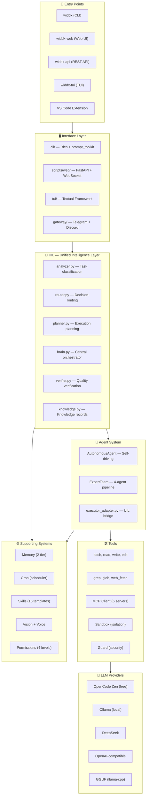

# ◈ WIDDX Nexus v3.0.0

**AI Operating System — Turn any LLM into a powerful, intelligent work machine**

<div align="center">

[](.)
[](https://www.python.org/)
[](LICENSE)
[](.)
[](.)

**By [MUHAMMAD MUSLIH](https://widdx.com) — 🇵🇸 Made in Palestine**

[النسخة العربية](README.md) | [Coding Standards](CODING_STANDARDS.md) | [Roadmap](ROADMAP.md)

</div>

---

## 💡 The Essence — Why WIDDX Nexus?

### The Problem

LLMs alone — even the most powerful ones — are fundamentally limited:

- **They forget** everything after each session
- **They can't run** real commands on your machine
- **They know nothing** about your project, files, or codebase
- **They can't work** in the background or on a schedule
- **They can't reach** the outside world (browser, APIs, messaging platforms)

The conventional fix: pay $200/month for a top-tier model… which still doesn't solve any of the above.

### The Solution — WIDDX Nexus Philosophy

> **Weak model + powerful tools + intelligent system = strong model.**

WIDDX Nexus is not just a "chat interface." It is an **AI Operating System** — a complete intelligence layer that wraps any LLM and equips it with:

- **Real tools** — bash, file read/write, search, browser automation
- **Persistent memory** — two-tier (global + project), learns from every conversation
- **Intelligent planning** — UIL Pipeline analyzes your input and decides the best execution strategy
- **Safe execution** — Sandbox isolation + dangerous-pattern guard + 4 permission levels
- **24/7 operation** — Cron Scheduler + Background Tasks + multi-platform delivery

### Before & After

| | Without WIDDX | With WIDDX Nexus |
|---|-------------|-----------------|
| **Model** | GPT-4 → $10/day | OpenCode Zen (free) → GPT-4-level results |
| **Memory** | Forgets every session | Learns and accumulates over time |
| **Execution** | You wait for responses | Background + Cron → works 24/7 |
| **Scale** | One conversation at a time | Delegation → 3 agents in parallel |
| **Safety** | No protection | Guard + Sandbox + Permissions |
| **Access** | Single app | CLI + Web + TUI + Telegram + Discord + VS Code |

---

## 🧬 What Exactly Is WIDDX Nexus?

WIDDX Nexus is a **fully integrated AI platform** that runs in your terminal, designed from the ground up to be:

### 1. A Central AI Brain

The **UIL (Unified Intelligence Layer)** is the heart of the system — a 7-stage pipeline that processes every input:

```
User Input
    │
    ▼
[1] Analyzer      → Classify task: code write? research? edit? system?
    │
    ▼
[2] Router         → Determine execution mode: simple chat? autonomous agent? expert team?
    │
    ▼
[3] Planner        → Decompose complex tasks into steps (no LLM needed)
    │
    ▼
[4] Executor       → Execute via AutonomousAgent, ExpertTeam, or direct tool
    │
    ▼
[5] Verifier       → Quality check: does the code run? is the HTML valid?
    │
    ▼
[6] Knowledge      → Record the outcome for future learning
    │
    ▼
[7] Feedback       → If verification fails → auto-retry with corrections
    │
    ▼
Final Result → User
```

### 2. Multi-Provider

No vendor lock-in. Use whatever model fits your needs and budget:

| Provider | Cost | Best For |
|----------|------|----------|
| **OpenCode Zen** | 🆓 Free | deepseek-v4-flash-free — excellent performance at zero cost |
| **Ollama** | 🆓 Free (local) | Fully local models — no internet, complete privacy |
| **DeepSeek** | 💰 ~$0.50/day | Deep reasoning at low cost |
| **OpenAI** | 💰💰 ~$10/day | GPT-4o for critical tasks |
| **GGUF** | 🆓 Free (local) | Direct `.gguf` file loading via llama-cpp — no Ollama needed |

**Automatic capability detection:** The system probes each provider to detect Tool Calling, Streaming, and Reasoning support — then adapts its interaction style accordingly.

**Graceful fallback:** If one provider fails, the system automatically tries the next.

### 3. Multi-Agent

- **AutonomousAgent** — Self-driving agent: analyzes, decides, executes, verifies. Retries on failure. Automatically validates after every file write and bash command.
- **ExpertTeam** — 4 specialized agents in a pipeline: Orchestrator → Researcher → Coder → Reviewer. Each passes its output to the next.
- **Delegation** — Distributes subtasks across parallel agents working simultaneously.
- **Background Tasks** — Work that runs in the background while you keep chatting.

### 4. Multi-Channel

Same brain, any interface:

| Channel | Command | Use Case |
|---------|---------|----------|
| **CLI** | `widdx` | Terminal — fastest and most powerful |
| **Web UI** | `widdx-web` | Browser — Dashboard + Chat + File Browser |
| **REST API** | `widdx-api` | Programmatic — integrate with your own systems |
| **TUI** | `widdx-tui` | Advanced terminal — Textual framework |
| **VS Code Extension** | — | In-editor — Explain, Fix, Generate |
| **Telegram + Discord** | — | Mobile — ask WIDDX from anywhere |

---

## 🏗️ Architecture



### Directory Structure

| Directory | Content | Language |
|-----------|---------|----------|
| `core/` | **Engine** — 80+ files: UIL, agents, tools, providers, MCP, Cron | Python |
| `core/uil/` | **Intelligence Layer** — 7-stage processing pipeline | Python |
| `cli/` | **Terminal UI** — Rich + prompt_toolkit + 27 commands | Python |
| `scripts/` | **Web UI + API** — FastAPI + WebSocket + frontend SPA | Python/JS |
| `tui/` | **Textual TUI** — Rich terminal interface | Python |
| `skills/` | **Skills** — 16 ready-made skill templates | Markdown |
| `tests/` | **Tests** — 41 files, 268 tests passing | Python |

---

## ⚡ Installation & Quick Start

### Quick Install

```bash
pip install widdx-nexus
widdx
```

### From Source

```bash
git clone https://github.com/widdx1990/widdx-nexus
cd widdx-nexus
pip install -e .
widdx
```

### Run Options

| Command | What It Does |
|---------|-------------|
| `widdx` | Launch CLI terminal interface (primary) |
| `widdx-web` | Launch Web UI — open `http://localhost:8000` |
| `widdx-api` | Launch REST API server |
| `widdx-tui` | Launch Textual TUI |

### Optional Dependencies

```bash
# Web UI & API
pip install widdx-nexus[api]

# Local GGUF models
pip install widdx-nexus[gguf]

# Text-to-Speech
pip install widdx-nexus[voice]

# Telegram + Discord
pip install widdx-nexus[gateway]

# Development
pip install widdx-nexus[dev]
```

### Configuration

Settings are stored in `.widdx/config.json` (created automatically on first run).  
API keys are stored in environment variables (`WIDDX_API_KEY_<PROVIDER>`), never in config files.

---

## 🧩 Core Components

### 🧠 UIL — Unified Intelligence Layer

The central brain. 7 processing stages that turn any input into a verified, executed result:

| Stage | File | Purpose |
|-------|------|---------|
| **Analyze** | `analyzer.py` | Classify the task (code_write, research, modify, etc.) and measure confidence |
| **Route** | `router.py` | Determine execution mode (chat, autonomous, expert_team, direct_tool) |
| **Plan** | `planner.py` | Decompose complex tasks into steps (rule-based, no LLM call) |
| **Execute** | `executors.py` | Execute via the appropriate agent |
| **Verify** | `verifier.py` | Quality checks — HTML, Python, Bash, generic code |
| **Knowledge** | `knowledge.py` | Persist outcome to `.widdx/knowledge.json` for learning |
| **Feedback** | `brain.py` | Auto-retry with fix instructions if verification fails |

**Supported task types:** CODE_READ, CODE_WRITE, CODE_MODIFY, CODE_REVIEW, RESEARCH, BROWSER, DATABASE, REASONING, CHAT, FILE_OPS, SYSTEM, COMPLEX, UNKNOWN

### 🤖 Agent System

- **AutonomousAgent** — Full tool-calling loop. Decides which tools to call, executes, validates results. Auto-retries on failure. Validates after every file write and bash command.
- **ExpertTeam** — 4 specialized agents: Orchestrator → Researcher → Coder → Reviewer. Each passes output to the next.
- **Delegation** — Parallel subtask distribution across simultaneous agents.
- **Background Tasks** — Non-blocking execution that runs while you continue working.

### 🔌 LLM Providers

All providers extend a unified `Provider` base class:

- **OpenCode Zen** — Free tier, `opencode.ai/zen/v1`, deepseek-v4-flash-free
- **Ollama** — Local models, auto-detects Tool Calling + Reasoning support
- **DeepSeek** — `api.deepseek.com`, native reasoning_content + streaming
- **OpenAI-compatible** — Any provider with an OpenAI-compatible API
- **GGUF** — Direct `.gguf` file loading via `llama-cpp-python`

Each provider supports: `chat()` (streaming), `chat_sync()` (blocking), `build_tools_schema()` (tool-to-function-calling conversion).

### 🛠️ Tools

**Built-in:** bash, read, write, edit, grep, glob, web_fetch, validate, list_files

**MCP (Model Context Protocol):** 6 default servers:
- **filesystem** — File operations
- **memory** — External persistent memory
- **fetch** — Web content retrieval
- **sequential-thinking** — Structured reasoning
- **playwright** — Browser automation
- **sqlite** — Database queries

**Security:** 24+ dangerous command patterns blocked (`rm -rf`, `dd`, `chmod 777`, `shutdown`, etc.). Scanning happens before execution.

### 🛡️ Sandbox & Security

3 protection layers:

1. **CommandGuard** — Scans commands before execution, blocks dangerous patterns
2. **PermissionManager** — 4 levels: permissive, normal, strict, silent
3. **SandboxExecutor** — Real isolation: WSL on Windows, cgroups on Linux, sandbox-exec on macOS, Docker fallback

### 💾 Memory

**Two tiers:**

1. **Global Memory** (`~/.widdx/memory/`) — Facts that carry across all projects
2. **Project Memory** (`.widdx/memory/`) — Project-specific facts

Each fact = a Markdown file with frontmatter (name, description, type).  
**MemoryLearner** auto-extracts facts every 2 turns.

**VectorMemory** for semantic search using TF-IDF (zero external dependencies) or Ollama embeddings.

### 📅 Cron Scheduler

- **CronScheduler** — Background thread, checks every 15 seconds
- **JobStore** — SQLite-backed, survives restarts
- **Supported formats:** `30m`, `2h`, `every day at 9`, `every monday at 10`, ISO timestamps, raw cron expressions
- **Commands:** `/cron add`, `/cron list`, `/cron remove`

### 🌐 Gateway

Same brain, reachable via:
- **Telegram** — `python-telegram-bot`
- **Discord** — `discord.py`

Each gateway runs in its own thread. Messages flow through the same UIL Pipeline.

### 🎯 Skills

16 ready-made skills — Prompt templates with optional Python extensions:

`app-builder`, `cinematic-experience`, `code-review`, `django-builder`, `document`, `explain-code`, `express-builder`, `fix-bug`, `flutter-builder`, `generate-tests`, `laravel-builder`, `react-builder`, `refactor`, `textual-master`, `tui-builder`, `vue-builder`

Invoke via `!name` or `/skill name`.

---

## 📋 Command Reference

### Chat Commands (27 total)

| Command | Description |
|---------|-------------|
| `/help` | Show help |
| `/model <name>` | Switch model |
| `/provider <name>` | Switch provider |
| `/tools` | List available tools |
| `/skills` | List available skills |
| `/mcp` | Manage MCP servers |
| `/cron add <time> "<task>"` | Schedule a recurring task |
| `/cron list` | List scheduled tasks |
| `/tasks` | View background tasks |
| `/agents` | View active agents |
| `/gateway start` | Start Telegram + Discord |
| `/voice on` | Enable text-to-speech |
| `/vision` | Manage vision (image) features |
| `/memory` / `/memories` | Manage memories |
| `/save` / `/load` | Save/load sessions |
| `/export` | Export session |
| `/sandbox` | Manage sandbox |
| `/theme` | Change theme |
| `/permissions` | Manage permissions |
| `/debug` / `/doctor` | Diagnostics |
| `/version` | Version info |
| `/clear` | Clear screen |
| `/exit` / `/quit` | Exit |

---

## 🎯 Real-World Examples

### 1. "Build me a simple accounting app"

```
⏱️ Time: 5-15 min (depends on model)
📊 Result: 70% of code ready in first pass
🔧 Polish: /retry + 2 rounds → complete app
```

Flows through UIL: Analyze (CODE_WRITE, COMPLEX) → Route (AUTONOMOUS) → Plan (MVC structure, DB, UI) → Execute (write files) → Verify (Python checks) → Result.

### 2. "Monitor my servers every 30 minutes"

```
/cron add 30m "check server logs for errors and alert me"

⏱️ Runs 24/7 without supervision
📊 Every 30 min: checks logs → ERROR found → sends alert
```

### 3. "Research live gold prices and write a calculator"

```
Delegation (2 parallel agents):
  Agent 1: web_fetch → find gold price API
  Agent 2: write calculator code in parallel

⏱️ Time: ~3 min (instead of 6 min sequential)
📊 Result: Complete app with live API integration
```

### 4. "Analyze this repository and write a report"

```
ExpertTeam:
  Orchestrator → breaks down the task
  Researcher → scans files (grep, glob, read)
  Coder → analyzes and categorizes
  Reviewer → reviews the final report

⏱️ Time: 5-10 min
📊 Result: Professional report with recommendations
```

---

## 📊 Project Stats

| Metric | Value |
|--------|-------|
| **Version** | v3.0.0 |
| **Tests** | 268 ✅ passing |
| **Test Files** | 41 |
| **Core Components** | 12+ |
| **LLM Providers** | 6 |
| **MCP Servers** | 6 default |
| **Skills** | 16 |
| **CLI Commands** | 27 |
| **API Endpoints** | 60+ |
| **Platforms** | Windows, Linux, macOS |
| **Interface Languages** | العربية, English |
| **License** | MIT |
| **Author** | MUHAMMAD MUSLIH ([widdx.com](https://widdx.com)) |

---

## 🧪 Testing

```bash
# All tests
pytest tests/ -v

# With coverage
pytest tests/ --cov=core --cov-report=html

# Integration test
python tests/run_integration_test.py
```

---

## 📄 License

MIT License — see [LICENSE](LICENSE).

Copyright © 2026 **MUHAMMAD MUSLIH (WIDDX)**

---

<div align="center">

**WIDDX Nexus v3.0.0** — Any model + our intelligent system = unlimited possibilities

[🌐 widdx.com](https://widdx.com) • [📦 PyPI](https://pypi.org/project/widdx-nexus/) • [📂 GitHub](https://github.com/widdx1990/widdx-nexus)

Made with ❤️ in Palestine 🇵🇸

</div>
