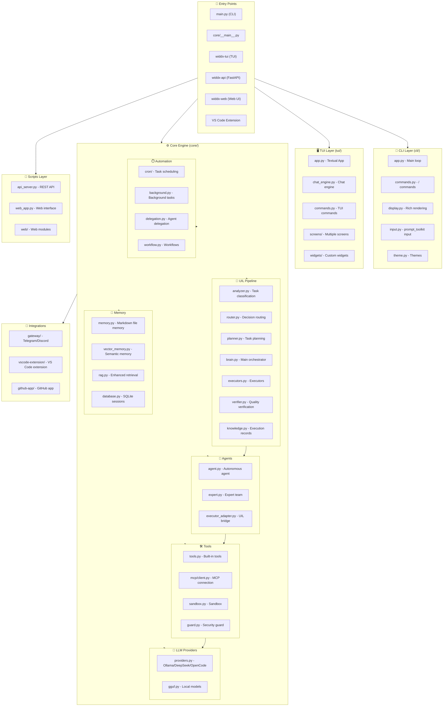
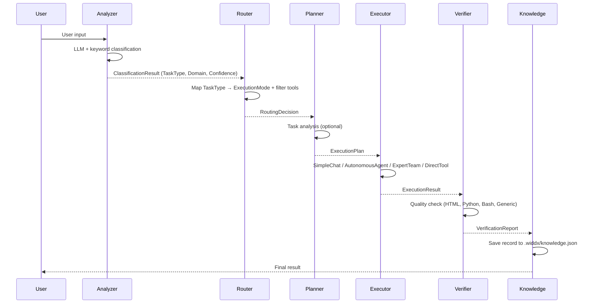

# 📋 Comprehensive Review Report — WIDDX Nexus v3.0.0

## 🧭 Overview

**WIDDX Nexus** is a fully integrated Terminal AI Workspace that serves as a platform for running LLM models with tool management, agents, and task automation. Developed by **MUHAMMAD MUSLIH (widdx.com)** in **Python ≥3.10**, it combines CLI, TUI, Web, API, VS Code Extension, and messaging platforms (Telegram/Discord).

---

## 📊 Architecture Summary



---

## 📐 Architectural Layers

### 🥇 Layer 1: Entry Points

| File | Function |
|:-----|:---------|
| `main.py` | Main entry → forwards to `scripts/main.py` |
| `core/__main__.py` | Runs via `python -m core` |
| `pyproject.toml` | Defines 4 commands: `widdx`, `widdx-tui`, `widdx-api`, `widdx-web` |

### 🥈 Layer 2: CLI (`cli/`)

- **app.py**: Main loop with project change detection (MD5 hash-based)
- **commands.py**: Handles ~25 slash commands (`/help`, `/model`, `/tools`, `/mcp`, etc.)
- **display.py**: Rich terminal rendering via the Rich library
- **input.py**: Advanced input via prompt_toolkit with RTL support
- **theme.py**: Color theme management

### 🥉 Layer 3: TUI (`tui/`)

- Full Textual application with multiple screens (help, settings, details, Ubuntu grid)
- Custom widgets: `diff_viewer.py`, `header.py`
- Full Arabic/RTL support via `python-bidi`

### ⚙️ Layer 4: Core Engine (`core/`)

#### A. UIL — Unified Intelligence Layer

**Full processing pipeline:**

```
User Input → Analyzer (classification) → Router (routing) → Planner (planning) → Executor (execution) → Verifier (verification) → Knowledge (recording)
```

**Classified Task Types:** `CODE_READ`, `CODE_WRITE`, `CODE_MODIFY`, `CODE_REVIEW`, `RESEARCH`, `BROWSER`, `DATABASE`, `REASONING`, `CHAT`, `FILE_OPS`, `SYSTEM`, `COMPLEX`, `UNKNOWN`

**Execution Modes:** `SIMPLE_CHAT`, `AUTONOMOUS`, `EXPERT_TEAM`, `DIRECT_TOOL`

**UIL Flow Diagram:**



#### B. Agent System

- **AutonomousAgent**: Full tool-calling loop with step tracking and automatic post-write validation
- **ExpertTeam**: 4 specialized agents (Orchestrator → Researcher → Coder → Reviewer)
- **executor_adapter.py**: Bridge between UIL contracts and real agent implementations

#### C. LLM Providers

| Provider | API | Models |
|:---------|:----|:--------|
| OpenCodeZen | `opencode.ai/zen/v1` | deepseek-v4-flash-free (free) |
| DeepSeek | `api.deepseek.com` | deepseek-v4, deepseek-v4-flash |
| Ollama | Local | All local models |
| OpenAI-Compatible | Custom URL | GPT-4o, GPT-4o-mini, etc. |
| GGUF | Local | Models loaded via `llama-cpp-python` |

#### D. Tool System

- **Built-in tools**: bash, read, write, edit, glob, grep, web_fetch, validate, list_files
- **MCP Tools**: filesystem, memory, fetch, sequential-thinking, playwright, sqlite
- **Dynamic Tools**: Dynamically registered tools (from skills, workflows)
- 24 dangerous command patterns that block destructive operations

#### E. Memory & Storage

- **MemoryStore**: Markdown memory with frontmatter (global + project-specific)
- **VectorMemory**: Semantic search using TF-IDF (zero external dependencies) or Ollama embeddings
- **RAGStore**: Retrieval-augmented generation (hybrid search)
- **Database**: SQLite for sessions, messages, and memories

#### F. Security & Control

- **CommandGuard**: Blocks 24+ dangerous patterns (rm -rf, fork bombs, format, disk write)
- **PermissionManager**: 4 levels (permissive, normal, strict, silent)
- **SandboxExecutor**: Isolation via WSL/Docker/process depending on OS

#### G. Self-Improvement

- **SelfReflection**: Extracts lessons from every interaction
- **SelfImprove**: Detects error patterns and tracks fixes
- **MemoryLearner**: Automatically extracts facts from conversations
- **Diagnostics**: Collects silent errors

### 📜 Layer 5: Scripts

- **api_server.py**: FastAPI with Bearer token auth, supports streaming
- **web_app.py**: Web interface with dashboard, sandbox, and chat
- **static/**: Web assets (CSS, JS, HTML)

### 🔗 Layer 6: Integrations

- **Gateway**: Telegram and Discord bridges (separate threads)
- **VS Code Extension**: Sidebar chat panel, context commands (Explain, Fix, Send)
- **GitHub App**: Basic integration

---

## ⭐ Key Features

1. **🧠 UIL Pipeline**: Intelligent task classification + routing + planning + execution + verification
2. **🤖 Autonomous Agents**: Self-driven agent with full tool-calling loop
3. **👥 Expert Team**: 4 specialized agents working as a team (Orchestrator → Researcher → Coder → Reviewer)
4. **🔌 6 LLM Providers**: Ollama, DeepSeek, OpenCode Zen, OpenAI-compatible, Local GGUF
5. **🛠️ MCP Integration**: 6 MCP servers (filesystem, memory, fetch, sequential-thinking, browser, SQLite)
6. **💾 Two-Tier Memory**: Global (cross-project) + Project-specific
7. **🔍 Semantic Search**: RAG + Vector Memory + SQLite FTS5
8. **⏱️ Cron Scheduling**: Flexible recurring task scheduling
9. **🛡️ Multi-Layer Security**: Guard + Permissions + Sandbox + Dangerous command detection
10. **🧪 Self-Improvement**: Lesson extraction + Error tracking + Auto prompt optimization
11. **🌐 RTL Support**: Full Arabic language support
12. **🔗 Platform Integrations**: VS Code, Telegram, Discord, GitHub, FastAPI Web
13. **📊 Budget Management**: Token Budget + Cost Tracking
14. **💾 Checkpoints**: Git-free file snapshots
15. **🚀 Auto-Commit**: Automatic git commits on success

---

## 🧪 Test Coverage

- `tests/` contains **~40 test files**
- Coverage includes: UIL, agents, providers, cron, memory, RAG, sandbox, guard, MCP, sessions, diff engine, linter, plugins, cache, checkpoint, auto_commit, delegation, token_budget
- Uses pytest with pytest-asyncio
- Custom markers: `asyncio`

---

## ⚠️ Observations & Potential Improvements

| # | Title | Description | Location |
|---|-------|-------------|----------|
| 1 | `chat.py` contains public functions instead of a class | 8 public functions (`print_system_msg`, `print_ai_msg`, etc.) could be organized into a `DisplayManager` class for easier maintenance | [chat.py](file:///e:/deepseek/chat-tool/core/chat.py) |
| 2 | `tools.py` is very large | The file contains all built-in tools in a single file (could be split into submodules) | [tools.py](file:///e:/deepseek/chat-tool/core/tools.py) |
| 3 | `proxy.py` fetches proxies from external URLs | `PROXY_SOURCES` contains 3 external URLs — any change to these sources could affect security | [proxy.py](file:///e:/deepseek/chat-tool/core/proxy.py#L23-L26) |
| 4 | `mcp/client.py` uses subprocess.Popen | Running MCP servers as subprocesses could be a security risk — command validation should be enforced | [mcp/client.py](file:///e:/deepseek/chat-tool/core/mcp/client.py) |
| 5 | `providers.py` contains multiple large classes | The file combines all providers in one file — could be split into separate modules per provider | [providers.py](file:///e:/deepseek/chat-tool/core/providers/providers.py) |
| 6 | `analyzer.py` calls LLM for every classification | High per-message cost — `LLMClassifier.classify()` calls `provider.chat()` for every user input | [analyzer.py](file:///e:/deepseek/chat-tool/core/uil/analyzer.py#L37-L60) |
| 7 | async/await inconsistency | Some parts use asyncio (api_server.py) while most code is synchronous — may cause integration issues | [api_server.py](file:///e:/deepseek/chat-tool/scripts/api_server.py) |
| 8 | `diagnostics.py` is not actively used | The ErrorCollector appears to be disabled by default — should be auto-enabled or documented | [diagnostics.py](file:///e:/deepseek/chat-tool/core/diagnostics.py) |
| 9 | `tools.py` has 24 danger patterns — list needs updating | Some patterns like `icacls` and `Restart-Computer` are Windows-specific — should add more Linux/MacOS patterns | [tools.py](file:///e:/deepseek/chat-tool/core/tools.py#L40-L65) |
| 10 | `session_v2.py` is not used across the codebase | Most modules use raw `messages` lists instead of `SessionV2` — incomplete integration | [session_v2.py](file:///e:/deepseek/chat-tool/core/session_v2.py) |
| 11 | `sys.path.insert(0, ...)` repeated in 6+ files | Every entry file adds the path to sys.path — could be unified in `core/__init__.py` | [app.py](file:///e:/deepseek/chat-tool/cli/app.py#L9-L11) |
| 12 | `project_structure.py` and `project_tracker.py` appear underutilized | Similar functionality to `project/scanner.py` and `project_context.py` — potential duplication | [project_structure.py](file:///e:/deepseek/chat-tool/core/project_structure.py) |

---

## ✅ Strengths

1. **Clean Architecture**: Clear separation between UIL, agents, tools, and providers — single responsibility for each component
2. **Decision Traceability**: Every UIL step is recorded in `DecisionStep` — full transparency
3. **Advanced Security**: 3-tier security (Guard → Permissions → Sandbox)
4. **Built-in Documentation**: `__init__.py` files clearly re-export public interfaces
5. **Multi-Interface Support**: CLI + TUI + Web + API + VS Code + Telegram + Discord
6. **Comprehensive Testing**: ~40 test files covering most modules
7. **Git Independence**: CheckpointManager works on any directory
8. **RTL Support**: Rare in CLI tools — a strong feature for Arabic users
9. **Self-Improvement**: Fully integrated system for lesson extraction and error tracking

---

## 🎯 Conclusion

**WIDDX Nexus v3.0.0** is an exceptionally ambitious and comprehensive project. It combines:

- **Power** of a multi-agent system
- **Intelligence** of the UIL pipeline for task classification and routing
- **Flexibility** of 6 different LLM providers
- **Security** with multiple protection layers
- **Integration** across 6 different platforms

The project appears to be in an advanced **Beta** stage (per pyproject.toml) with a clean, extensible architecture. The improvements suggested above are quality-of-life recommendations — the current code works efficiently and covers a wide range of use cases.
